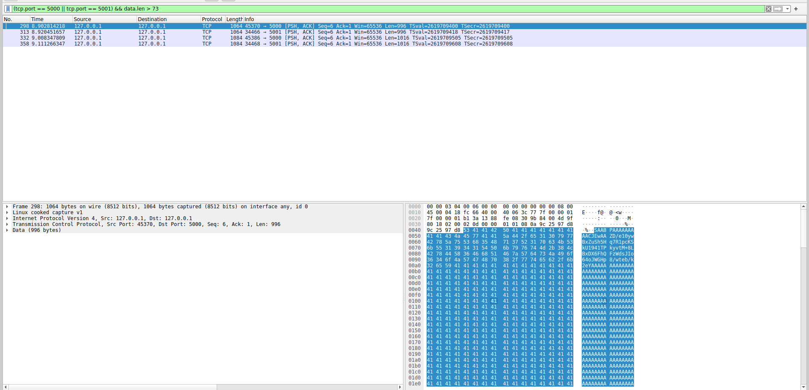
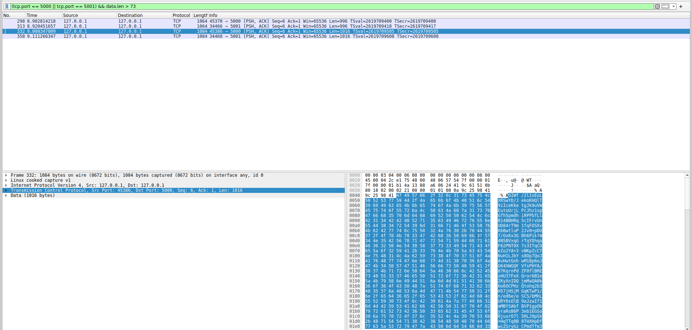

# SecTrans

## Group 9 

* **Falcoz** Alban 
* **Galli** Evan 
* **Gripari** Alexandre 
* **Lassauniere** Theo

# Security Analysis

### Man-in-the-Middle Attacks: 

To evaluate the security of our application against man-in-the-middle attacks, we monitored the communication between the server and the client using the program Wireshark.  
The objective was to determine whether an attacker intercepting the communication would be able to deduce the content of the exchanged messages.

We use the library [libsodium](https://doc.libsodium.org/) to encrypt the communications, it uses the *XSalsa20-Poly1305* algorithm.

Using Wireshark we can clearly see the different sent packets:


The public keys are exchanged during the handshake period. These messages are simply encoded in base 64, so we can decompose them. Here is an example : 

```
SAABPAAAAAAAAACJEwAAZD/e10ywBxZuSh5Hq7R1pcKSkU1941TPkyvtM+8LBxDX6FhQFzWdsJIo64oJWGHp8/wteb/k2eYAAAAAAAAAAAAAAAAAAAAAAAAAAAAAAAAAAAAAAAAAAAAAAAAAAAAAAAAAAAAAAAAAAAAAAAAAAAAAAAAAAAAAAAAAAAAAAAAAAAAAAAAAAAAAAAAAAAAAAAAAAAAAAAAAAAAAAAAAAAAAAAAAAAAAAAA...
```

In binary we obtain something like:

```
01001000 00000000 00000001 00111100 00000000 00000000 00000000 00000000
00000000 00000000 00000000 10001001 00010011 00000000 00000000 01100100 
00111111 11011110 11010111 01001100 10110000 00000111 00010110 01101110 
01001010 00011110 01000111 10101011 10110100 01110101 10100101 11000010 
10010010 10010001 01001101 01111101 11100011 01010100 11001111 10010011 
00101011 11101101 00110011 11101111 00001011 00000111 00010000 11010111 
11101000 01011000 01010000 00010111 00110101 10011101 10110000 10010010 
00101000 11101011 10001010 00001001 01011000 01100001 11101001 11110011 
11111100 00101101 01111001 10111111 11100100 11011001 11100110 00000000
...
```

Here, the first byte corresponds to the 'H' character, meaning the packet is for an hand shake.
The second byte (0) tells that the packet is the first one of 1 packets (third byte).
The next 8 bytes are for the total size of the message (packet's content).
All the remaining characters are for the message in itself.


After the hand shake, all the messages sent between the server and the client are encrypted : 



```
GIWf/2l1sEuLXRSwYD/JekoKHQlT9iIceKketgJk9uVWEutoUrjLPcJhz1spGfh5pmdhiRPPbTLlB14BBHRq5cIFrvUnUD84rT9m1fqFOSXvKbBwtluP2Jv0+pDU7/OxKx3GBh6Pik7W4N5BVxqGrTqYDhqaF62PNT0X7s3ITqCOeZo2YA+3vNKpZcCTNuH1LJbYs8Op7QoJAvHwtGnhwM18p6oJGK4XWGQFVfsPHYA/87KqrnPdZF0flBREsHU37FeXQror6B1eZKyXnIDQjmMaQA0k6o6OCPHzQtohq2b3H57jHSjMGqKTwP1/n/ed6e/eSCS/bMhLURY0sOlB9aJzwIf1mMBYSAbfBVP1gpObyraRsB6P3eb1EGSo0juxrO7l5RLJ9pSk+HqTTq8B8THXHpDfwcZSryGzCPmdTfm3jAU9BQ2kUvSqUENGVZZVpJ8kD0ja3xJBab4RbZnswLMVcnsVb4USjx+cBrsu1hHCPmFRrM96kZxHsJScL6/5sfQFgZLnVhCG/+EWSQlW2zzVQQcvdLedAgSuseb+H/NKvMSeGSb92U3hyYiKmnei5fnVcV0b/8vjV6Xp4pV+8/ey4mF/m05Fi0WoNgKqwV0ZfDAjVzYSU3WLpck5Og9zlAYWxnIdvmdkD1UJrbNbEH5oojsYbEhtUaAQfh5zO12tFFhqMt6m6Nxe33KTwxCUGKZK60fyd03HHX3db74+2dM+04WHMj5KkqbnwQjpxgMQzkN+RXY+TOH0x9SwshMEF91Yh4oSkp0tt/uL3e/ycmDOYnT6giL6QtUflxIzWuug8yOBN6VXSNBfwV5ev+Npz5Som0k4fL5v2kKLqdpTpOgetI6/Afg3C4rDQnoXHmpyEqJn3kJKWGbvb3DziDwAIQC1Y0PfJC90n38hKSzCQpyKOM9KDIydVn5BDxkG8tn4Ms1rlxTbG/aLtaEczhPopJRJFH1s1qPFIvM3CnD3YveCSZmHzzlteA1znNCKsrKvaczCpd81+Cw=
```

Even if we try to convert this, we won't obtain the original message since we don't have the private key to decrypt it.

This test showed that the encryption effectively prevents man-in-the-middle attacks since an attacker without the private key cannot break the encryption.

### Fuzzing the server

We tried to send random packets to the server to see if it handles it correctly.

```shell
exec 3<>/dev/tcp/127.0.0.1/5000
cat /dev/urandom >&3
```

The server correctly refuses the message.

### Fuzzing the file uploaded

We tested the file upload function by creating damaged files using zzuf (`cat docs/subject.pdf | zzuf > fuzzed.pdf`), modifying their data randomly. These files were uploaded to the server to check for vulnerabilities such as crashes or inappropriate processing.

The server processed the corrupted files appropriately, without crashes or unexpected behaviour, demonstrating the robustness of the file management mechanisms. 

### Checking the filename

We have implemented protections during file downloads by only using the basename of the requested file, effectively stripping any path components. This approach mitigates path traversal attacks, ensuring that an attempt to access files outside the intended directory (e.g., using `../../file_to_access`) will fail. The system only looks for files in a designated folder, preventing unauthorized access to other files on the server.

### Reverse engineering

We did not implement specific protections against reverse engineering because "security by obscurity" is not a reliable approach. While techniques such as obfuscation can increase the difficulty of reverse engineering, they do not provide true security. A highly skilled individual with expertise in assembly language and enough time can still reverse-engineer the code. Instead, our focus is on building robust security mechanisms that don't rely on hiding the implementation but rather on protecting sensitive data and ensuring system integrity.

### Replay attack

We are protected against replay attacks because even if a legitimate request is intercepted and resent, it will not succeed. After the initial request, the attacker would still need the private key to continue the session. Without this key, they cannot complete the interaction, ensuring that replayed requests are ineffective.

To enforce this point a little more we could have ensure that the nounce used to cipher the packet sent by a client is effectivly only used once.

### Fuzzing the communication

We are protected against fuzzing attempts because our communication protocol requires valid, well-formed messages signed with the private key. Random or malformed inputs generated during fuzzing will be rejected, as the attacker cannot produce properly signed messages without access to the private key.

## Recommendations about the security architecture

To further enhance the security of our system, we recommend considering the following improvements:

Authentication:
* While we have focused on encryption to secure the communication channel, implementing a robust authentication mechanism would add an extra layer of protection. This would ensure that only authorized users can access the server and perform file uploads or downloads.

Logging:
* Introducing a logging system would be beneficial for monitoring and auditing server activities. Logs would help track who is making which requests and who is uploading which files. Having detailed logs is essential for detecting any suspicious or malicious behavior from a potentially corrupt employee and investigating incidents if they occur.

Denial of Service Mitigation:
* Currently, the server waits for a message after responding to a handshake. However, if the server receives another handshake instead of the expected message, it fails to handle the situation, which can lead to a Denial of Service vulnerability. The system should be modified to properly manage these unexpected scenarios, either by rejecting invalid handshakes or implementing appropriate fallback mechanisms to prevent the server from becoming unresponsive.

Antivirus Scanning Before File Upload:
* While our file upload system processes files without crashing or misbehaving, it would be prudent to scan uploaded files for malware or malicious content before storing them on the server. Running antivirus or anti-malware software on the server once the file has been uploaded would reduce the risk of uploading harmful files, ensuring that malicious files are detected and neutralized before they can cause harm.
